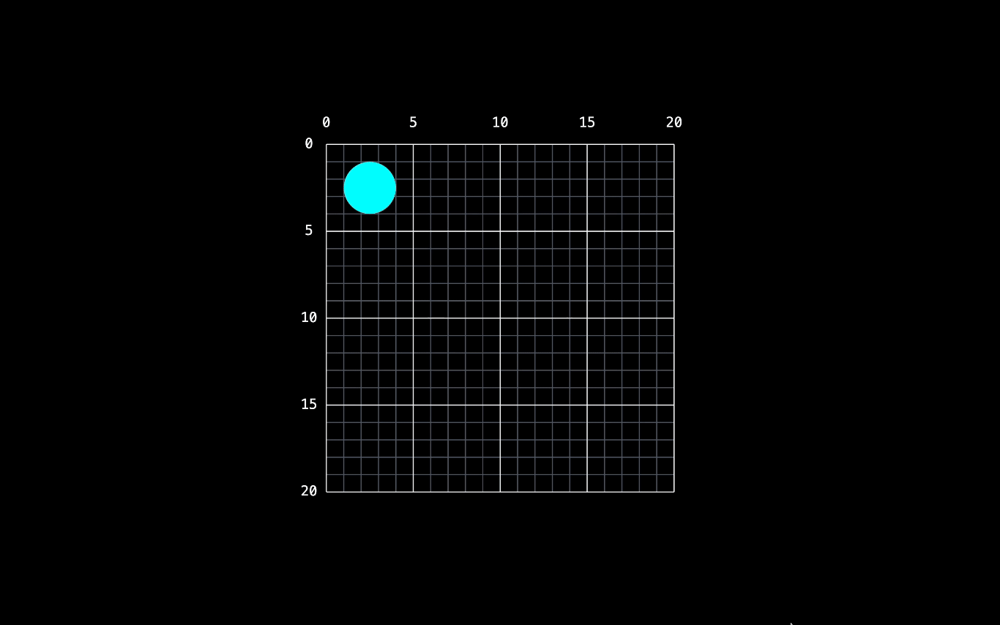

# Moving Vectors: Transform Your Boring SVGs With Intuitive Animations

<br>



## Getting Started

The essential procedures required for initiating and configuring the project within your local environment.

### Prerequisites

1. Upgrade the Bun Runtime Toolkit to the latest release version.

    ```sh
    bun upgrade
    ```
### Installation

1. Install the "Moving Vectors" packages and dependencies using the Bun Runtime Toolkit.

    ```sh
    bun add @moving-vectors/moving-vectors
    ```

2. Import the required animation functions and begin coding the animations you desire.

    ```js
    import { animate, all, tween, wait } from "moving-vectors";
    ```

## License

This repository is distributed under the MIT License. See `LICENSE` for additional information.